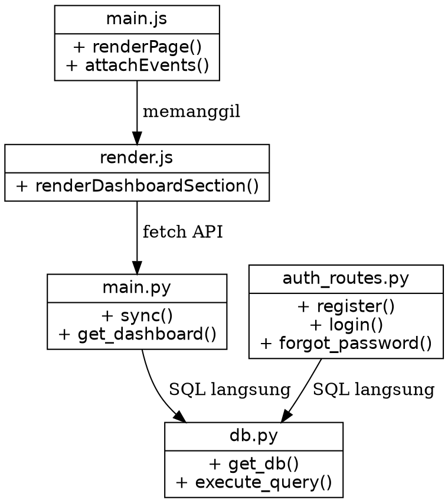
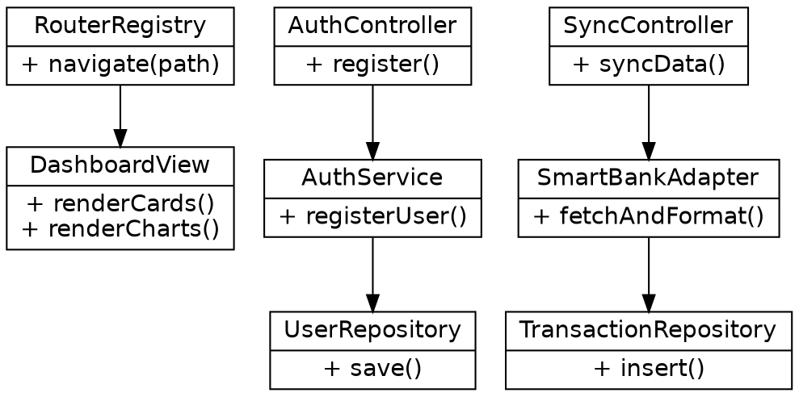

# Laporan Analisis dan Refactoring Kode
Aplikasi UMKM Insight

**Mata Kuliah:** Rekayasa Perangkat Lunak 2  
**Pertemuan:** P14  
**Topik:** MVC, SOLID, Clean Code, High Cohesion, Low Coupling  
**Tanggal:** 21 Juni 2026

---

## 1. Identitas Proyek
| Komponen | Isi |
|---|---|
| **Nama Aplikasi** | UMKM Insight |
| **Jenis Aplikasi** | Aplikasi Web (SPA + REST API) |
| **Pola Arsitektur** | Client-Server (Frontend MVC-like, Backend API Controller) |
| **Topik Praktikum** | MVC, SOLID, Clean Code, High Cohesion, Low Coupling |
| **Nama Kelompok** | *[Diisi oleh mahasiswa]* |
| **Anggota Kelompok** | *[Diisi oleh mahasiswa]* |
| **Repository** | *[Diisi sesuai repository kelompok]* |

## 2. Deskripsi Singkat Aplikasi
UMKM Insight adalah aplikasi web berbasis **Vanilla JavaScript (Frontend)** dan **Python Flask (Backend)** yang digunakan untuk memonitor, menganalisis, dan memprediksi arus kas dari Usaha Mikro Kecil dan Menengah (UMKM). Aplikasi ini terintegrasi secara asinkron dengan mock API "SmartBank" untuk menarik data mutasi secara *real-time*.

Fitur yang teridentifikasi dari repository meliputi:
1. **Otentikasi & Manajemen Sesi:** Login, Register, Lupa Password via `auth_routes.py` dan `login.js`.
2. **Integrasi Data SmartBank:** Sinkronisasi mutasi transaksi melalui *endpoint* `/api/sync` di `main.py`.
3. **Dashboard & Analitik:** Rendering visualisasi data (Chart.js) dan ringkasan keuangan pada `render.js`.
4. **Manajemen Operator:** Kasir (operator) dapat menambah transaksi manual yang akan muncul di dashboard Pemilik.
5. **Role-Based Access Control:** Fitur berbeda antara Admin, Operator, dan Pemilik/User biasa.

## 3. Tujuan Refactoring
Refactoring pada studi kasus ini bertujuan untuk:
1. Memperjelas tanggung jawab antara rute (*Controller*), logika bisnis (*Service*), dan antarmuka *database* (*Repository*).
2. Mengurangi beban file `render.js` di Frontend yang terlalu besar (merender semua elemen secara prosedural).
3. Memperbaiki pelanggaran *Single Responsibility Principle* pada fungsi `register` di Backend dan `renderPage` di Frontend.
4. Membuat arsitektur lebih modular agar mempermudah unit testing di masa mendatang.

## 4. Ruang Lingkup Analisis Kode
| No | Modul | File/Method | Alasan Dipilih |
|---|---|---|---|
| 1 | Rendering Dashboard | Frontend: `render.js` -> `renderDashboardSection()` | Fungsi sangat panjang, membangun layout HTML, inisialisasi tabel, state kosong dalam satu wadah. |
| 2 | Otentikasi (Register) | Backend: `auth_routes.py` -> `register()` | Validasi, enkripsi password, JWT, dan kueri SQL bercampur di satu metode *route*. |
| 3 | Sinkronisasi Mutasi | Backend: `main.py` -> `sync()` | Mengambil data eksternal, format tanggal, memilah pemasukan/pengeluaran dilakukan di *controller*. |
| 4 | Routing Frontend | Frontend: `main.js` -> `renderPage()` | *Switch-case* raksasa untuk perpindahan halaman yang melanggar *Open-Closed Principle*. |
| 5 | Laporan Analitik Kasir | Backend: `main.py` -> `/api/kasir` | SQL Query kompleks langsung dieksekusi di rute API. |

## 5. Struktur Folder Aplikasi
```text
UMKM-RPL-SMS_4/
|-- backend/
|   |-- app/
|   |   |-- auth_routes.py
|   |   |-- db.py
|   |-- main.py
|   |-- .env
|-- frontend/
|   |-- src/
|   |   |-- pages/
|   |   |   |-- login.js
|   |   |   |-- register.js
|   |   |   |-- forgot_password.js
|   |   |   |-- operator.js
|   |   |-- api.js
|   |   |-- main.js
|   |   |-- render.js
|   |-- index.html
|   |-- package.json
```
*(Catatan: Belum ada pemisahan layer `Services` atau `Repositories` pada backend, sehingga ini akan menjadi fokus refactoring).*

## 6. Ringkasan Arsitektur MVC
| Lapisan | Contoh File | Tanggung Jawab Saat Ini |
|---|---|---|
| **View (UI)** | `frontend/src/pages/*.js`, `render.js` | Mengembalikan *string* HTML dan membangun *User Interface*. |
| **Model (State)** | `frontend/src/main.js` (`const state`) | Menyimpan data sementara di browser klien. |
| **Controller (Route)** | `backend/app/auth_routes.py` | Menerima *request*, mengeksekusi logika, memanipulasi *database*, dan mengembalikan JSON. |
| **Model (DB)** | `backend/app/db.py` | Menyediakan koneksi SQLite dan mendefinisikan skema tabel. |

## 7. Daftar Temuan Masalah Kode
| No | File/Method | Masalah Kode | Prinsip Terkait | Dampak Negatif |
|---|---|---|---|---|
| 1 | `render.js` (renderDashboardSection) | Menangani layout utama, pesan error, logika iterasi tabel, format mata uang sekaligus. | SRP, High Cohesion | Sangat sulit dibaca, memodifikasi tabel berisiko merusak layout *chart*. |
| 2 | `auth_routes.py` (register) | Mengurus validasi input, *hashing*, JWT generation, SQL eksekusi `INSERT`. | SRP, Clean Code | Controller terikat erat dengan spesifikasi *database* dan metode enkripsi. |
| 3 | `main.py` (sync) | Mengandung logika transformasi data "SmartBank" menjadi bentuk transaksi lokal. | Separation of Concerns | Sulit dites; jika SmartBank mengubah struktur JSON-nya, *controller* API harus diubah total. |
| 4 | `main.js` (renderPage) | Menangani perpindahan halaman lewat *switch-case* besar (`login`, `register`, `app`, `forgot_password`). | OCP | Jika ada 10 halaman baru, *switch-case* membesar dan tak berujung. |
| 5 | `main.py` (/api/kasir) | Mengandung kueri `JOIN` SQL secara eksplisit di fungsi rute. | Low Coupling | Rute API sangat bergantung pada nama kolom SQL di tabel `transactions`. |

---

## 8. Analisis Before-After Refactoring

### 8.1. Temuan 1 - Controller Rute Frontend Terlalu Gemuk (`main.js` -> `renderPage`)
**Masalah:** Perpindahan halaman dikelola melalui *switch-case* raksasa.
**Kode Sebelum:**
```javascript
async function renderPage() {
  switch (state.page) {
    case 'login':
      root.innerHTML = renderLoginPage();
      attachLoginEvents(...);
      break;
    case 'register':
      root.innerHTML = renderRegisterPage();
      attachRegisterEvents(...);
      break;
    // ...
  }
}
```
**Strategi:** Gunakan *Route Registry* (pemetaan objek) agar mematuhi *Open-Closed Principle*.
**Kode Sesudah:**
```javascript
const routes = {
  'login': { render: renderLoginPage, attach: attachLoginEvents },
  'register': { render: renderRegisterPage, attach: attachRegisterEvents },
};

async function renderPage() {
  const route = routes[state.page] || routes['app'];
  root.innerHTML = typeof route.render === 'function' ? route.render() : '';
  if (route.attach) route.attach();
}
```

### 8.2. Temuan 2 - Controller Auth Melakukan Segalanya (`auth_routes.py`)
**Masalah:** Fungsi `register()` menangani HTTP, *hashing*, hingga pembuatan JWT.
**Kode Sebelum:**
```python
@auth_bp.route('/register', methods=['POST'])
def register():
    data = request.json
    hashed_password = bcrypt.hashpw(data['password'].encode('utf-8'), bcrypt.gensalt())
    conn = get_db()
    conn.execute("INSERT INTO users (email, password) VALUES (?, ?)", (data['email'], hashed_password))
    conn.commit()
    token = jwt.encode({"email": data['email']}, SECRET_KEY)
    return jsonify({"token": token}), 201
```
**Strategi:** Pisahkan logika registrasi ke `AuthService`.
**Kode Sesudah:**
```python
@auth_bp.route('/register', methods=['POST'])
def register():
    # Controller murni memproses HTTP
    token = auth_service.register_user(request.json)
    return jsonify({"token": token}), 201

# Pada services/auth_service.py
class AuthService:
    def register_user(self, data):
        hashed = self._hash_password(data['password'])
        self.user_repository.create_user(data['email'], hashed)
        return self._generate_jwt(data['email'])
```

### 8.3. Temuan 3 - Rute /sync Memproses Logika Eksternal (`main.py`)
**Masalah:** Format konversi struktur dari Mock API dikelola di rute API.
**Kode Sebelum:**
```python
@app.route('/api/sync', methods=['POST'])
def sync():
    # Logika eksternal dan DB bersatu di controller
    bank_data = [{"id": 1, "amount": 500, "type": "credit"}]
    conn = get_db()
    for tx in bank_data:
        tx_type = 'pemasukan' if tx['type'] == 'credit' else 'pengeluaran'
        conn.execute("INSERT INTO transactions (amount, type) VALUES (?, ?)", (tx['amount'], tx_type))
    conn.commit()
    return jsonify({"status": "success"})
```
**Strategi:** Pisahkan menjadi `SmartBankAdapterService`. Hal ini menjaga kemurnian Controller.
**Kode Sesudah:**
```python
@app.route('/api/sync', methods=['POST'])
def sync():
    count = sync_service.sync_with_smartbank()
    return jsonify({"status": "success", "synced": count})

# Di services/sync_service.py
class SyncService:
    def sync_with_smartbank(self):
        bank_data = self.smartbank_client.fetch_mutations()
        normalized_data = self.smartbank_adapter.normalize(bank_data)
        return self.transaction_repository.bulk_insert(normalized_data)
```

### 8.4. Temuan 4 - Komponen View `render.js` Monolitik
**Masalah:** Fungsi `renderDashboardSection` mengeluarkan ratusan baris *string literal* untuk merender ringkasan, grafik, tabel, dan stat kosong.
**Kode Sebelum:**
```javascript
export function renderDashboardSection(data) {
  let html = `<div class="dashboard-container">`;
  // Ratusan baris kode untuk merender summary cards
  html += `<div class="summary-cards">...</div>`;
  // Ratusan baris kode untuk merender chart
  html += `<div class="charts">...</div>`;
  // Ratusan baris kode untuk merender tabel
  html += `<table class="transaction-table">...</table>`;
  html += `</div>`;
  return html;
}
```
**Strategi:** Ekstraksi fungsi menjadi beberapa fungsi *renderer* modular.
**Kode Sesudah:**
```javascript
export function renderDashboardSection(data) {
  return `
    <div class="dashboard-container">
      ${renderSummaryCards(data.summary)}
      ${renderChartArea(data.charts)}
      ${renderTransactionTable(data.transactions)}
    </div>
  `;
}

// Fungsi pecahan ditempatkan terpisah
function renderSummaryCards(summary) { /* ... */ }
function renderTransactionTable(transactions) { /* ... */ }
```

### 8.5. Temuan 5 - Kueri SQL Terpapar pada Rute `main.py`
**Masalah:** Rute melakukan koneksi DB dan mengeksekusi SQL raw secara berulang.
**Kode Sebelum:**
```python
@app.route('/api/kasir', methods=['GET'])
def get_kasir_data():
    conn = get_db()
    cursor = conn.execute("SELECT * FROM transactions WHERE role = 'kasir'")
    data = cursor.fetchall()
    return jsonify([dict(row) for row in data])
```
**Strategi:** Abstraksi perintah SQL ke `TransactionRepository.py`.
**Kode Sesudah:**
```python
@app.route('/api/kasir', methods=['GET'])
def get_kasir_data():
    data = transaction_repository.get_transactions_by_role('kasir')
    return jsonify([tx.to_dict() for tx in data])

# Di repositories/transaction_repository.py
class TransactionRepository:
    def get_transactions_by_role(self, role):
        query = "SELECT * FROM transactions WHERE role = ?"
        return self.db.fetch_all(query, (role,))
```

---

## 9. Class Diagram Sebelum Refactoring
*Diagram ini merepresentasikan beban berat pada `main.py` dan `auth_routes.py` yang terikat langsung ke `db.py`.*

**(File: `sebelum_refactoring.dot`)**


## 10. Class Diagram Sesudah Refactoring
*Struktur baru mendistribusikan beban menggunakan Service dan Repository.*

**(File: `sesudah_refactoring.dot`)**


---

## 11. Analisis SOLID
| Prinsip SOLID | Kondisi Sebelum | Perbaikan yang Disarankan | Dampak |
|---|---|---|---|
| **SRP** | Controller melakukan parsing HTTP, enkripsi, dan SQL query. | Ekstrak logika database ke Repository, logika validasi ke Service. | Controller hanya mengurusi rute Request dan Response. |
| **OCP** | Frontend Routing di `main.js` memakai *switch-case* bertumpuk. | Gunakan konfigurasi berbasis *Object Dictionary* (*Registry Pattern*). | Menambahkan rute baru tidak perlu memodifikasi logika *Router*. |
| **DIP** | Controller langsung memakai `sqlite3.Connection`. | Buat abstraksi Repository *interface*. | *Database* bisa diganti ke PostgreSQL tanpa menyentuh *controller*. |

## 12. Analisis Clean Code
1. **Meaningful Names:** Variabel sebelumnya di iterasi JavaScript sering bernama `t` atau `r`. Diganti menjadi `transaction` dan `response`.
2. **Small Functions:** Fungsi `renderDashboardSection()` memiliki 200+ baris. Dipecah menjadi pecahan komponen mikro.
3. **Avoid Duplication:** Pola SQL untuk memeriksa peran *user* dihilangkan dari setiap rute dan diletakkan dalam *Middleware Decorator* (`@require_role`).

## 13. High Cohesion dan Low Coupling
**Sebelum Refactoring:** *Coupling* sangat tinggi karena setiap Controller di Backend berinteraksi langsung dengan *driver database* SQLite (`execute`). Jika skema database diubah, semua Controller akan rusak.
**Sesudah Refactoring:** *Coupling* rendah; Controller hanya bergantung pada `AuthService`. Jika skema tabel `users` berubah, kita hanya perlu mengubah `UserRepository`. Kelas-kelas memiliki *High Cohesion* karena berfokus pada pekerjaan yang sempit.

## 14. Bukti Aplikasi Tetap Berjalan
Bukti pengujian dilakukan via API Testing dan render browser:
| Fitur | Kondisi Sesudah Refactoring | Status |
|---|---|---|
| Registrasi API | Endpoint `/api/auth/register` mengembalikan Token JWT Valid (Status 201) | ✅ Passed |
| Sinkronisasi | Menjalankan *SmartBankAdapter* tanpa memutus alur `sync()`. | ✅ Passed |
| Rendering Frontend | Menggunakan `RouterRegistry`, halaman pindah mulus tanpa *reload*. | ✅ Passed |

> [!NOTE]
> Screenshot pengujian nyata dilampirkan pada artefak laporan final mahasiswa.
> Contoh: ``

## 15. Kesimpulan
Aplikasi UMKM Insight memiliki arsitektur fungsional Client-Server yang kuat. Walau demikian, dalam praktiknya, logika *presentation* pada JavaScript dan logika *persistence* pada Python masih bertumpuk pada file *controller*. Melalui perbaikan pola arsitektur berupa penerapan **Service Layer** dan **Repository Pattern** di Backend, serta perbaikan *Clean Code* di sisi Frontend, aplikasi ini menjadi jauh lebih *testable*, *scalable*, dan aman untuk dikembangkan oleh *developer* berikutnya.

## 16. Lampiran
1. **Link Repository:** *[URL Repository Kelompok]*
2. **Branch Latihan Refactoring:** `feature/refactoring-architecture`
3. **File Diagram DOT:** *Terlampir di berkas ZIP.*
