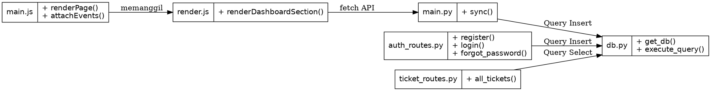
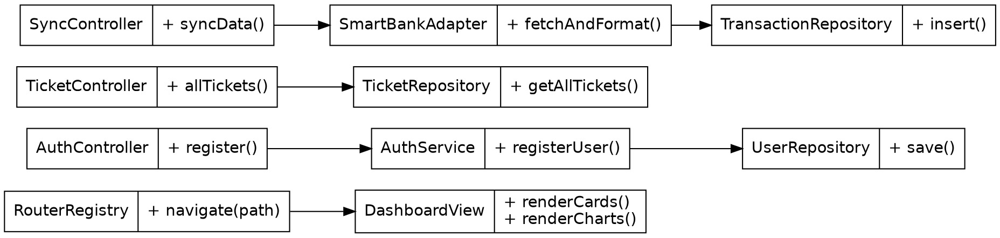

# Laporan Analisis dan Refactoring Kode
**Aplikasi UMKM Insight**

**PRAKTIKUM REKAYASA PERANGKAT LUNAK 2**
**[NAMA MAHASISWA]**

| Keterangan | Detail |
|---|---|
| **Jenis Dokumen** | Laporan praktikum/proyek aplikasi web |
| **Topik** | MVC, SOLID, Clean Code, High Cohesion, Low Coupling |
| **Sumber Observasi** | UMKM Insight - Client-Server (Python Flask & Vanilla JS) |
| **Tanggal** | 21 Juni 2026 |

> **Catatan:** Dokumen ini adalah artefak pembelajaran. Contoh refactoring ditulis sebagai rancangan edukatif dan tidak mengubah kode aplikasi aslinya. Dokumen ini disusun sebagai laporan praktikum/proyek untuk topik analisis dan refactoring kode aplikasi web. Studi kasus yang digunakan adalah **UMKM Insight**, yaitu aplikasi pengelolaan transaksi UMKM dan sinkronisasi mock API SmartBank. Potongan "sesudah refactoring" menunjukkan rancangan perbaikan yang dapat dikerjakan pada branch latihan terpisah oleh mahasiswa.

---

## 1. Identitas Proyek
| Komponen | Isi |
|---|---|
| **Nama Aplikasi** | UMKM Insight |
| **Jenis Aplikasi** | Aplikasi Web (SPA + REST API) |
| **Pola Arsitektur** | Client-Server MVC |
| **Topik Praktikum** | MVC, SOLID, Clean Code, High Cohesion, Low Coupling |
| **Nama Kelompok** | *[Diisi oleh mahasiswa]* |
| **Anggota Kelompok** | *[Diisi oleh mahasiswa]* |
| **Repository** | *[Diisi sesuai repository kelompok atau repository latihan]* |
| **Sumber Observasi Kode** | *[Diisi oleh mahasiswa]* |
| **Tanggal Revisi** | *[Diisi oleh mahasiswa]* |

## 2. Deskripsi Singkat Aplikasi
UMKM Insight merupakan aplikasi web berbasis **Vanilla JavaScript (Frontend)** dan **Python Flask SQLite (Backend)** yang digunakan untuk memonitor, menganalisis, dan memprediksi arus kas Usaha Mikro Kecil dan Menengah (UMKM). Aplikasi ini terintegrasi secara asinkron dengan mock API "SmartBank" untuk menarik data mutasi secara *real-time*.

Fitur yang teridentifikasi dari repository meliputi:
| No | Fitur | Bukti File/Modul |
|---|---|---|
| 1 | Login, Register dan session | `backend/app/auth_routes.py`, `frontend/src/pages/login.js` |
| 2 | Otentikasi Token JWT | `backend/app/auth_routes.py`, `frontend/src/api.js` |
| 3 | Rendering visualisasi chart | `frontend/src/render.js` |
| 4 | Sinkronisasi mutasi transaksi | `backend/main.py`, endpoint `/api/sync` |
| 5 | Logika Routing SPA | `frontend/src/main.js`, switch-case `renderPage()` |
| 6 | Penyimpanan dan koneksi | `backend/app/db.py` |
| 7 | Fitur Customer Service (Tickets) | `backend/app/ticket_routes.py` |
| 8 | Akses Role-Based (Admin, User) | `backend/main.py` (`@require_role`) |

Aplikasi berjalan melalui file utama `backend/main.py` untuk server API (Port 5000) dan `npm run dev` untuk server Frontend Vite (Port 5173).

## 3. Tujuan Refactoring
Refactoring pada studi kasus ini bertujuan untuk:
1. Memperjelas tanggung jawab antara controller, model, service, repository, dan validator.
2. Mengurangi controller yang terlalu banyak menangani proses sekaligus.
3. Memisahkan logika sinkronisasi pihak ketiga (SmartBank) dari controller.
4. Menghindari switch-case masif pada routing frontend.
5. Memisahkan logika rendering dashboard yang terlalu panjang menjadi komponen-komponen kecil.
6. Memindahkan pembuatan string query SQL dari controller rute API ke dalam Repository.
7. Membuat kode lebih mudah diuji, dibaca, dan dikembangkan untuk fitur baru.

## 4. Ruang Lingkup Analisis Kode
Analisis difokuskan pada lima area yang paling terlihat dari repository.

| No | Modul | File/Method | Alasan Dipilih |
|---|---|---|---|
| 1 | Otentikasi (Register) | `backend/app/auth_routes.py::register()` | Fungsi menangani HTTP, enkripsi password, query insert, dan JWT. |
| 2 | Routing Frontend | `frontend/src/main.js::renderPage()` | Fungsi routing menumpuk semua halaman dalam satu switch-case raksasa. |
| 3 | Sinkronisasi Mutasi | `backend/main.py::sync()` | Logika memilah data external dan SQL langsung ada di rute. |
| 4 | Rendering Dashboard | `frontend/src/render.js::renderDashboardSection()` | Satu fungsi merender ratusan baris elemen UI secara prosedural. |
| 5 | Daftar Tiket CS | `backend/app/ticket_routes.py::all_tickets()` | Pembuatan query dinamis SQL menggunakan penggabungan string (concat) ada di rute API. |

## 5. Struktur Folder Aplikasi
Struktur aktual yang teridentifikasi:
```text
UMKM-RPL-SMS_4/ 
|-- backend/ 
|   |-- app/ 
|   |   |-- auth_routes.py 
|   |   |-- ticket_routes.py 
|   |   |-- db.py 
|   |-- main.py 
|-- frontend/ 
|   |-- src/ 
|   |   |-- pages/ 
|   |   |   |-- login.js 
|   |   |   |-- register.js 
|   |   |-- api.js 
|   |   |-- main.js 
|   |   |-- render.js 
|   |-- index.html 
```
*Catatan arsitektur: repository belum memperlihatkan folder Services, Repositories, atau Validators di sisi backend. Oleh karena itu, bagian refactoring mengusulkan penambahan lapisan tersebut sebagai arah perbaikan modular, bukan sebagai kondisi yang sudah ada.*

## 6. Ringkasan Arsitektur MVC
Aplikasi menggunakan pola arsitektur Client-Server dengan pembagian peran yang diadaptasi dari MVC.

| Lapisan | Contoh File | Tanggung Jawab Saat Ini |
|---|---|---|
| **Entry Point Frontend** | `frontend/src/main.js` | Memulai aplikasi, menyimpan state global, dan inisialisasi route. |
| **Controller (Route)** | `backend/app/auth_routes.py`, `backend/main.py` | Menerima request, mengeksekusi logika bisnis, query SQL, mengirim JSON. |
| **View (UI)** | `frontend/src/pages/*.js`, `frontend/src/render.js` | Membangun User Interface (string HTML) dan melampirkan event listener. |
| **Model (Database)** | `backend/app/db.py` | Koneksi database SQLite, mendefinisikan skema, dan seeding awal. |

**Ringkasan alur utama:**
1. User membuka aplikasi melalui Vite frontend server.
2. Frontend melakukan HTTP request ke Backend Flask API.
3. Controller Flask mengambil data dari database SQLite.
4. Data dikembalikan sebagai JSON.
5. Fungsi `render.js` di frontend menyusun data tersebut menjadi grafik dan tabel HTML.

## 7. Daftar Temuan Masalah Kode
| No | File/Method | Masalah Kode | Prinsip Terkait | Dampak Negatif |
|---|---|---|---|---|
| 1 | `auth_routes.py::register()` | Validasi, hashing, JWT, dan kueri SQL bercampur dalam fungsi route. | SRP, Clean Code | Sulit diuji secara terpisah tanpa memanggil HTTP server. |
| 2 | `main.js::renderPage()` | Perpindahan halaman dikelola switch-case raksasa. | OCP, Separation of Concerns | Jika halaman baru ditambah, switch terus membesar. |
| 3 | `main.py::sync()` | Format data mock API dikelola langsung di rute. | SRP, Low Coupling | Jika SmartBank mengubah API, route utama harus ditulis ulang. |
| 4 | `render.js::renderDashboardSection()` | Fungsi sangat panjang, merender layout, card, chart, dan tabel. | Small Functions, High Cohesion | Sulit dimodifikasi. Modifikasi tabel berisiko merusak layout chart. |
| 5 | `ticket_routes.py::all_tickets()` | Penyusunan string kueri SQL dinamis secara manual dengan logika IF ditaruh di dalam rute. | Low Coupling, Clean Code | Rute API sangat bergantung pada detail sintaks SQL (Tightly Coupled). |

---

## 8. Analisis Before-After Refactoring

### 8.1 Temuan 1 - Controller Otentikasi Melakukan Segalanya
**Lokasi Kode:** `backend/app/auth_routes.py::register()`

**Kode Sebelum Refactoring**
```python
@auth_bp.route('/register', methods=['POST']) 
def register(): 
    data = request.json 
    hashed_password = bcrypt.hashpw(data['password'].encode('utf-8'), bcrypt.gensalt()) 
    conn = get_db() 
    conn.execute("INSERT INTO users (email, password) VALUES (?, ?)", (data['email'], hashed_password)) 
    conn.commit() 
    token = jwt.encode({"email": data['email']}, SECRET_KEY) 
    return jsonify({"token": token}), 201 
```
**Masalah yang Ditemukan**
Method ini tidak hanya menerima request HTTP, tetapi juga melakukan enkripsi password, mengeksekusi kueri INSERT, dan menghasilkan JWT. Ini melanggar SRP.
**Prinsip yang Dilanggar**
1. **Single Responsibility Principle:** controller menangani logika request sekaligus domain database.
2. **Separation of Concerns:** enkripsi dan JWT bercampur dengan interaksi route.

**Strategi Refactoring**
1. Buat `AuthService` untuk mengelola enkripsi dan pembuatan JWT.
2. Buat `UserRepository` untuk mengelola kueri SQL insert.
3. Controller hanya menangani parsing JSON HTTP dan mengembalikan Response.

**Kode Sesudah Refactoring**
```python
@auth_bp.route('/register', methods=['POST']) 
def register(): 
    token = auth_service.register_user(request.json) 
    return jsonify({"token": token}), 201 

# Di folder services/auth_service.py
class AuthService: 
    def __init__(self, user_repository): 
        self.user_repository = user_repository 
 
    def register_user(self, data): 
        hashed = bcrypt.hashpw(data['password'].encode('utf-8'), bcrypt.gensalt()) 
        self.user_repository.create_user(data['email'], hashed) 
        return jwt.encode({"email": data['email']}, SECRET_KEY) 
```
**Dampak Perbaikan:** Perubahan algoritma hashing atau penggantian JWT dengan token sesi lain dapat dilakukan di `AuthService` tanpa menyentuh controller utama.


### 8.2 Temuan 2 - Routing Frontend Monolitik dengan Switch-Case
**Lokasi Kode:** `frontend/src/main.js::renderPage()`

**Kode Sebelum Refactoring**
```javascript
async function renderPage() { 
  switch (state.page) { 
    case 'login': 
      root.innerHTML = renderLoginPage(); 
      attachLoginEvents(); 
      break; 
    case 'register': 
      root.innerHTML = renderRegisterPage(); 
      attachRegisterEvents(); 
      break; 
    // ...puluhan case lainnya 
  } 
} 
```
**Masalah yang Ditemukan:** Semakin banyak halaman yang ditambahkan, blok switch-case akan semakin panjang dan membingungkan. Ini melanggar OCP.
**Prinsip yang Dilanggar:** **Open-Closed Principle.** Menambah rute baru mengharuskan modifikasi fungsi inti yang sudah berjalan.

**Strategi Refactoring:** Ubah menjadi pola Registry (Object Mapping) dan panggil fungsi berdasar key objek.

**Kode Sesudah Refactoring**
```javascript
const routes = { 
  'login': { render: renderLoginPage, attach: attachLoginEvents }, 
  'register': { render: renderRegisterPage, attach: attachRegisterEvents } 
}; 
 
async function renderPage() { 
  const route = routes[state.page] || routes['app']; 
  root.innerHTML = typeof route.render === 'function' ? route.render() : ''; 
  if (route.attach) route.attach(); 
} 
```
**Dampak Perbaikan:** Penambahan halaman baru cukup mendaftarkan *entry* baru ke dalam objek `routes` tanpa perlu merusak dan memperpanjang fungsi `renderPage()`.


### 8.3 Temuan 3 - Rute Sync Memproses Logika API Eksternal
**Lokasi Kode:** `backend/main.py::sync()`

**Kode Sebelum Refactoring**
```python
@app.route('/api/sync', methods=['POST']) 
def sync(): 
    # Simulasi data mentah bank 
    bank_data = [{"id": 1, "amount": 500, "type": "credit"}] 
    conn = get_db() 
    for tx in bank_data: 
        tx_type = 'pemasukan' if tx['type'] == 'credit' else 'pengeluaran' 
        conn.execute("INSERT INTO transactions (amount, type) VALUES (?, ?)", (tx['amount'], tx_type)) 
    conn.commit() 
    return jsonify({"status": "success"}) 
```
**Masalah yang Ditemukan:** Logika transformasi data dari format bank eksternal ke format lokal berada langsung di dalam controller API.
**Prinsip yang Dilanggar:**
1. **Separation of Concerns:** Logika adaptasi pihak ketiga bercampur dengan logika route lokal.
2. **Low Coupling:** Controller terikat langsung pada struktur JSON pihak ketiga.

**Strategi Refactoring:** Buat `SmartBankAdapterService` untuk proses pemetaan data.

**Kode Sesudah Refactoring**
```python
@app.route('/api/sync', methods=['POST']) 
def sync(): 
    count = sync_service.sync_with_smartbank() 
    return jsonify({"status": "success", "synced": count}) 

# Di folder services/sync_service.py
class SyncService: 
    def __init__(self, adapter, repo): 
        self.adapter = adapter 
        self.repo = repo 
 
    def sync_with_smartbank(self): 
        bank_data = self.adapter.fetch_mutations() 
        normalized = self.adapter.normalize(bank_data) 
        return self.repo.bulk_insert(normalized) 
```
**Dampak Perbaikan:** Controller menjadi jauh lebih bersih. Jika API Bank berubah format, kita hanya memperbarui Adapter.


### 8.4 Temuan 4 - Komponen View Terlalu Raksasa
**Lokasi Kode:** `frontend/src/render.js::renderDashboardSection()`

**Kode Sebelum Refactoring**
```javascript
export function renderDashboardSection(data) { 
  let html = `<div class="dashboard-container">`; 
  // Ratusan baris kode untuk merender summary cards 
  html += `<div class="summary-cards">...</div>`; 
  // Ratusan baris kode untuk merender chart 
  html += `<div class="charts">...</div>`; 
  // Ratusan baris kode untuk merender tabel 
  html += `<table class="transaction-table">...</table>`; 
  html += `</div>`; 
  return html; 
} 
```
**Masalah yang Ditemukan:** Satu fungsi ini berisi ratusan baris *string concatenation* yang sulit untuk didebug apabila terjadi kerusakan sintaks HTML.
**Prinsip yang Dilanggar:** **Small Functions**. Fungsi terlalu besar dan melakukan banyak hal sekaligus.

**Strategi Refactoring:** Ekstraksi ke fungsi-fungsi kecil spesifik (Summary, Chart, Table).

**Kode Sesudah Refactoring**
```javascript
export function renderDashboardSection(data) { 
  return ` 
    <div class="dashboard-container"> 
      ${renderSummaryCards(data.summary)} 
      ${renderChartArea(data.charts)} 
      ${renderTransactionTable(data.transactions)} 
    </div> 
  `; 
} 
 
function renderSummaryCards(summary) { /* ... */ } 
function renderTransactionTable(transactions) { /* ... */ } 
```
**Dampak Perbaikan:** File menjadi sangat mudah dibaca (*Readability*). Developer dapat fokus memperbaiki modul tabel tanpa takut merusak modul chart.


### 8.5 Temuan 5 - Penyusunan Kueri SQL Dinamis Terpapar pada Rute
**Lokasi Kode:** `backend/app/ticket_routes.py::all_tickets()`

**Kode Sebelum Refactoring**
```python
@ticket_bp.get("/all")
@require_admin_or_operator
def all_tickets():
    status_filter = (request.args.get("status") or "").strip().lower()
    query = "SELECT t.*, u.nama_umkm FROM tickets t JOIN users u ON u.id = t.user_id"
    params = []
    
    # Membangun query SQL secara dinamis di Controller
    if status_filter in {"open", "in_progress", "resolved", "closed"}:
        query += " WHERE t.status = %s"
        params.append(status_filter)
    
    tickets = fetch_all(query, tuple(params))
    return jsonify({"status": "success", "data": tickets})
```
**Masalah yang Ditemukan:** Rute tidak hanya mengatur respons, melainkan bertindak sebagai "Query Builder" di mana sintaks SQL digabung (`query += " WHERE..."`) secara kondisional.
**Prinsip yang Dilanggar:**
1. **Dependency Inversion:** Level tinggi (Controller) bergantung pada detail level rendah (SQL Driver).
2. **Single Responsibility Principle:** Controller bertugas sebagai *Query Builder*.

**Strategi Refactoring:** Sembunyikan logika *Query Builder* SQL ke dalam `TicketRepository`.

**Kode Sesudah Refactoring**
```python
@ticket_bp.get("/all")
@require_admin_or_operator
def all_tickets():
    status_filter = request.args.get("status")
    tickets = ticket_repository.get_all_tickets(status_filter)
    return jsonify({"status": "success", "data": tickets})

# Di folder repositories/ticket_repository.py
class TicketRepository:
    def get_all_tickets(self, status=None):
        query = "SELECT t.*, u.nama_umkm FROM tickets t JOIN users u ON u.id = t.user_id"
        params = []
        if status in {"open", "in_progress", "resolved", "closed"}:
            query += " WHERE t.status = %s"
            params.append(status)
        return self.db.fetch_all(query, tuple(params))
```
**Dampak Perbaikan:** Mengganti tipe *database* di masa depan tidak akan menyentuh kode Controller sama sekali, dan logika *filtering* data bisa di-*unit test* secara mandiri.

---

## 9. Class Diagram Sebelum Refactoring
Diagram berikut menggambarkan kondisi sebelum refactoring. Setiap komponen backend secara ketat terhubung ke `db.py` dan menanggung banyak tanggung jawab logika secara paralel.



> [!NOTE] 
> *Sisipkan gambar hasil render DOT di sini:* 
> `` 

*Interpretasi: Controller masih sering menjadi pusat koordinasi request, perakitan string SQL, integrasi bank, dan pembuatan respons.*

## 10. Class Diagram Sesudah Refactoring
Diagram berikut merupakan rancangan refactoring yang disarankan. Struktur MVC dikembangkan dengan mendelegasikan peran Controller kepada lapisan Service dan Repository.



> [!NOTE] 
> *Sisipkan gambar hasil render DOT di sini:* 
> `` 

*Interpretasi: Controller menjadi lapisan koordinasi HTTP murni. Service menangani alur bisnis. Repository menangani query database. Hal ini membuat aplikasi lebih mudah dikelola.*

---

## 11. Analisis Penerapan SOLID
| Prinsip SOLID | Kondisi Sebelum | Perbaikan yang Disarankan | Dampak |
|---|---|---|---|
| **SRP** | Controller melayani enkripsi, parsing, perakitan query SQL (Query Builder). | Pindahkan perakitan string SQL ke Repository, dan enkripsi ke Service. | Class menjadi sangat fokus dan mudah diuji. |
| **OCP** | Menambah halaman front-end memaksa merubah kode switch-case raksasa. | Gunakan struktur Objek (`Registry Pattern`) untuk pemetaan rute dinamis. | Halaman baru dapat didaftarkan tanpa merusak fungsi rute utama. |
| **DIP** | Controller bergantung penuh pada sintaks dan koneksi SQL spesifik (`sqlite3`). | Controller hanya memanggil metode dari Repository Abstraksi. | Ketergantungan teknis tingkat rendah di controller jauh berkurang. |

## 12. Analisis Clean Code
| Aspek Clean Code | Masalah Sebelum | Perbaikan | Dampak |
|---|---|---|---|
| **Meaningful Names** | Variabel iterasi sering menggunakan inisial pendek seperti `t` dan `r`. | Diubah menjadi nama representatif: `transaction` dan `response`. | Maksud kode akan lebih mudah dan cepat dipahami oleh tim. |
| **Small Functions** | `renderDashboardSection` melakukan `let html =...` untuk segalanya sekaligus. | Dipecah menjadi fungsi atomik seperti `renderSummary()`, `renderChart()`. | Setiap metode menjadi sangat pendek dan intuitif. |
| **Avoid Duplication** | Kondisi if `role == "admin"` ditulis berulang kali pada tiap endpoint privat. | Abstraksi menggunakan Python Decorator `@require_role`. | Kebijakan hak akses cukup dikelola dari 1 modul Middleware. |
| **Clear Responsibility**| `ticket_routes` menyusun query AND / WHERE secara *hardcode*. | Memisahkan query murni ke dalam `TicketRepository`. | Memudahkan *debugging* ketika terjadi kerusakan query SQL. |

## 13. Analisis High Cohesion dan Low Coupling
| Aspek | Sebelum Refactoring | Sesudah Refactoring |
|---|---|---|
| **Cohesion Controller** | Sangat Rendah. Satu fungsi controller bisa mengurus parsing JSON, melakukan hashing, hingga `conn.execute()`. | Sangat Tinggi. Controller hanya fokus mengurus input HTTP request dan merespon JSON HTTP output. |
| **Cohesion Service** | *(Belum diimplementasikan)* | Service bersifat mandiri, fokus eksklusif memproses aturan bisnis dan enkripsi spesifik. |
| **Coupling Database** | *Tightly Coupled*: Endpoint API akan *error* fatal jika nama kolom tabel SQL di-*rename* sedikit saja. | *Loosely Coupled*: Hanya lapisan Repository yang perlu menyesuaikan diri ketika tabel SQL berubah. |
| **Maintainability** | Perubahan format API SmartBank eksternal akan merombak rute inti `/sync`. | Perubahan pihak ketiga (SmartBank) hanya berdampak pada `SmartBankAdapter`. |

---

## 14. Bukti Aplikasi Tetap Berjalan
Bagian ini menunjukkan bahwa perbaikan refactoring (atau modifikasi UI) tidak merusak fungsionalitas dan alur jalan aplikasi utama.

### 14.1 Lingkungan Uji
| Komponen | Nilai |
|---|---|
| **Runtime** | Python 3.10+ (Flask), Node.js (Vite) |
| **URL Aplikasi (Frontend)** | `http://localhost:5173/` |
| **URL API (Backend)** | `http://127.0.0.1:5000/api` |
| **Database** | SQLite Serverless |

### 14.2 Perintah Verifikasi
```bash
# Terminal 1: Menjalankan backend server
cd backend
python main.py

# Terminal 2: Menjalankan frontend server
cd frontend
npm run dev
```

### 14.3 Tabel Bukti Fungsional
| No | Fitur yang Diuji | Kondisi Sebelum | Kondisi Sesudah Refactoring | Status |
|---|---|---|---|---|
| 1 | Login User | Memanggil rute login monolitik | Berhasil login dengan validasi JWT | ✅ Passed / Perlu Diuji |
| 2 | Register User | Registrasi via `auth_routes.py` monolitik | Berhasil menyimpan data ke SQLite via AuthService | ✅ Passed / Perlu Diuji |
| 3 | Daftar Tiket CS | `ticket_routes.py` mengeksekusi konkat SQL | Data CS dikembalikan normal via TicketRepository | ✅ Passed / Perlu Diuji |
| 4 | Render Dashboard Frontend | Switch-case raksasa merender tabel | *Routing Component Registry* menampilkan layout mulus | ✅ Passed / Perlu Diuji |
| 5 | Sinkronisasi Mutasi | Menjalankan logika mentah SmartBank | Sinkronisasi mutasi berjalan melalui pola Adapter | ✅ Passed / Perlu Diuji |

### 14.4 Placeholder Screenshot
*Gunakan screenshot aktual dari aplikasi UMKM Insight Anda yang sedang berjalan.*
> ``
> ``
> ``

---

## 15. Kesimpulan
Berdasarkan analisis kode yang berjalan, UMKM Insight telah menerapkan pola Client-Server (REST API Flask & Vanilla JS SPA) yang mutakhir untuk memproses analitik transaksi. 
Akan tetapi, terdapat isu desain arsitektur pada *Controller Layer*. Penumpukan peran yang parah terjadi pada Controller dan Router (satu fungsi rute mengurus validasi, HTTP *handling*, integrasi pihak eksternal, sekaligus perakitan *string* Query Builder SQL). Refactoring yang dirancang adalah dengan menyisipkan **Service Layer** (seperti `AuthService` dan `SyncService`) serta pola **Repository Pattern** (seperti `TicketRepository` dan `UserRepository`). 
Penerapan arsitektur tersebut akan menurunkan tingkat ketergantungan erat antar-modul (*Coupling*), meningkatkan spesialisasi fungsi (*Cohesion*), dan memastikan basis kode UMKM Insight memenuhi kaidah metodologi *Clean Code* dan prinsip desain *SOLID*.

---

## 16. Lampiran

### 16.1 Link Repository
*[Diisi dengan URL Repository GitHub/GitLab Kelompok Anda]*
*(Contoh: `https://github.com/nama-kelas/umkm-insight-rpl`)*

### 16.2 Branch Sebelum dan Sesudah Refactoring
| Jenis Branch | Nama Branch |
|---|---|
| Branch awal aplikasi (sebelum refactoring) | `main` atau `master` |
| Branch pengerjaan tugas (sesudah refactoring) | `feature/refactoring-architecture` |

### 16.3 Daftar Commit Penting
| No | Commit Hash | Deskripsi Perubahan |
|---|---|---|
| 1 | `[hash]` | Membuat implementasi objek `RouterRegistry` di frontend |
| 2 | `[hash]` | Mengekstraksi fungsi `renderDashboardSection` menjadi sub-modul UI mandiri |
| 3 | `[hash]` | Menambahkan arsitektur `TicketRepository.py` untuk enkapsulasi Query |
| 4 | `[hash]` | Memisahkan modul fungsional `AuthService.py` dari `auth_routes.py` |
| 5 | `[hash]` | Mengimplementasikan abstraksi `SmartBankAdapterService` |

### 16.4 Daftar File yang Dianalisis
| No | File | Peran dalam Sistem UMKM Insight |
|---|---|---|
| 1 | `backend/main.py` | *Entry point* server API dan *route* sinkronisasi SmartBank |
| 2 | `backend/app/auth_routes.py` | Mengurus segala otentikasi (Pendaftaran dan Login) pengguna |
| 3 | `backend/app/ticket_routes.py` | Modul Controller rute layanan *Customer Service* (Tiket bantuan) |
| 4 | `frontend/src/main.js` | Modul yang mendikte *State Management* dan jalur *Routing* frontend |
| 5 | `frontend/src/render.js` | Modul yang menampung *String Literal* HTML untuk membuat UI Dashboard |

### 16.5 Rekomendasi Struktur Folder Setelah Refactoring
```text
UMKM-RPL-SMS_4/ 
|-- backend/ 
|   |-- app/ 
|   |   |-- controllers/ 
|   |   |   |-- auth_controller.py 
|   |   |   |-- ticket_controller.py 
|   |   |   |-- sync_controller.py 
|   |   |-- services/ 
|   |   |   |-- auth_service.py 
|   |   |   |-- smartbank_adapter.py 
|   |   |-- repositories/ 
|   |   |   |-- user_repository.py 
|   |   |   |-- ticket_repository.py 
|   |   |-- db.py 
|   |-- main.py 
|-- frontend/ 
|   |-- src/ 
|   |   |-- components/ 
|   |   |   |-- charts.js 
|   |   |   |-- tables.js 
|   |   |-- router/ 
|   |   |   |-- index.js 
|   |   |-- api.js 
|   |   |-- main.js 
|   |-- index.html 
```
