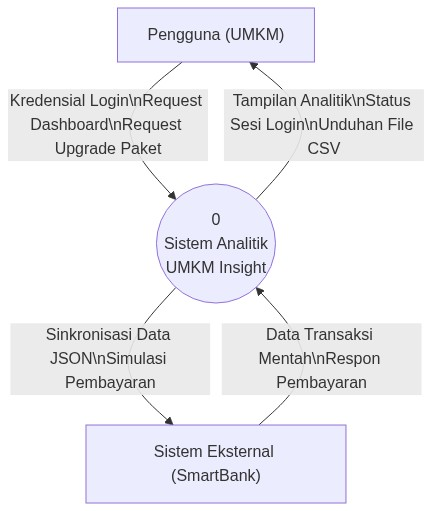

# Tugas Praktek Mandiri - Spesifikasi Ringkas Sistem

**Nama Aplikasi:** UMKM Insight  
**Platform:** Web-based Application (SaaS)

---

## 1. Deskripsi Fungsional (Ruang Lingkup Sistem)

**UMKM Insight** adalah aplikasi web berbasis *Software as a Service* (SaaS) berkonsep *"Read-Only Analytics"* yang dirancang untuk membantu UMKM memantau performa keuangan bisnis melalui dasbor analitik interaktif. Dalam batasan ruang lingkupnya, aplikasi ini tidak difungsikan sebagai sistem kasir pencatat transaksi (*No CRUD*), melainkan khusus menarik data riwayat transaksi mentah dari simulasi perbankan eksternal (*SmartBank*) untuk kemudian diolah menjadi kalkulasi metrik utama (Total Penjualan, Pengeluaran, dll) beserta visualisasi grafiknya. Sistem yang dibangun dengan arsitektur *Client-Server* (Frontend Vanilla JS & Backend Python Flask) ini juga secara ketat menerapkan pembatasan akses (*Role-based Limitation*), di mana kelengkapan fitur—seperti visibilitas grafik donat, tombol ekspor CSV, hingga modul AI Proyeksi Bisnis—akan terbuka atau terkunci secara otomatis menyesuaikan dengan tingkat paket langganan pengguna (*Free, Basic, Pro,* atau *Enterprise*).

---

## 2. Visualisasi Desain (Diagram Konteks / DFD Level 0)

Berikut adalah Diagram Konteks (Data Flow Diagram Level 0) yang memvisualisasikan batas sistem serta arus data (interaksi) antara entitas eksternal dengan Sistem Analitik UMKM Insight.

---

## 3. Pengujian (Test Case)

Berikut adalah satu contoh pengujian (*Test Case*) terperinci untuk memastikan logika inti aplikasi—yakni limitasi fitur berdasarkan paket langganan—berjalan sesuai spesifikasi.

*   **Test Case ID:** TC-UMKM-01
*   **Fitur Utama yang Diuji:** Rendering Dashboard Analytics berdasarkan Role/Paket
*   **Skenario Pengujian:** Memverifikasi tampilan dan fungsionalitas batasan akses pada halaman Dashboard untuk pengguna dengan level akun **"Paket Free" (Gratis)**.
*   **Prasyarat (*Pre-Condition*):** 
    1. Pengguna telah terdaftar di database MySQL dan status berlangganannya tercatat sebagai "Free".
    2. Modul *Backend* (Flask) berjalan dengan normal dan terhubung ke data transaksi *SmartBank*.
    3. Pengguna berada di halaman *Login*.

*   **Data Input (*Test Data*):**
    *   **Email:** akun.gratis@umkm.id
    *   **Password:** katasandi123

*   **Langkah-langkah Pengujian (*Test Steps*):**
    1. Masukkan *Email* dan *Password* yang valid pada form *Login* *Frontend*.
    2. Klik tombol **"Masuk / Login"**.
    3. Tunggu sistem memvalidasi kredensial (API memanggil `/api/auth/login`) dan mengarahkan pengguna secara otomatis ke halaman **"Dashboard"**.
    4. Saat Dashboard termuat, perhatikan *Widget Card* di bagian atas layar (Area Ringkasan Data).
    5. Lakukan inspeksi visual pada *Widget* **"Rata-rata Penjualan"**.
    6. *Scroll* layar ke bawah menuju area visualisasi data (Grafik Chart.js). Periksa apakah **Grafik Perbandingan Bulanan** dan **Grafik Distribusi Transaksi (Donut Chart)** ditampilkan.
    7. Perhatikan bagian tabel riwayat transaksi, cobalah berinteraksi dengan *dropdown* **"Filter Transaksi"** dan klik tombol **"Export CSV"**.

*   **Hasil yang Diharapkan (*Expected Result*):**
    1. Pengguna berhasil masuk dan sistem memuat halaman Dashboard dengan mengambil data dari `/api/umkm_insight/dashboard`.
    2. Pada area *Widget Card*, nilai "Total Penjualan", "Total Transaksi", dan "Total Pengeluaran" berhasil dikalkulasi dan ditampilkan berupa angka yang valid.
    3. **(Penting)** Pada *Widget* "Rata-rata Penjualan", angka nominal **TIDAK** ditampilkan. Sebaliknya, widget tersebut dalam status **terkunci** (menampilkan teks peringatan dan/atau ikon gembok yang meminta pengguna *upgrade* paket).
    4. **(Penting)** Semua visualisasi grafik (Baik diagram batang maupun donat) tidak dimuat (*blank* atau tergantikan oleh *banner* "Upgrade paket Anda untuk melihat grafik ini").
    5. **(Penting)** Elemen UI *dropdown* "Filter Transaksi" berstatus *disabled* (berwarna abu-abu dan tidak dapat diklik).
    6. **(Penting)** Tombol aksi "Export CSV" disembunyikan atau berstatus *disabled*.

*   **Status / Hasil Aktual:** `[  ] PASS   [  ] FAIL` *(Kolom ini diisi saat eksekusi pengujian manual dilakukan).*
